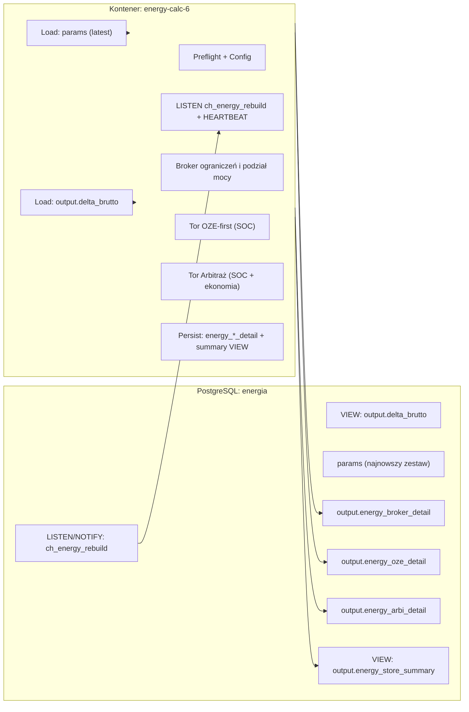
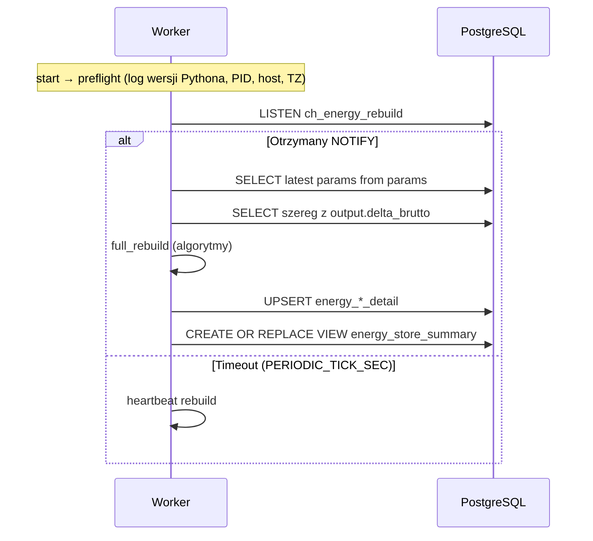

# energy-calc-6 — Pełna dokumentacja (Worker SOC + Arbitraż)

> Snapshot repo: aktualny stan gałęzi `main`. Dokument zawiera architekturę, proces działania, strukturę katalogów, opis wszystkich plików, **OBSZERNY ROZDZIAŁ METODYKI** i dokładny słownik pól tworzonych tabel `output.energy_*_detail` (wzory i kolejność obliczeń).

## 🗺️ Architektura (wysoki poziom)



---

## ⚙️ Konfiguracja `.env` (przykład)

```ini
# --- DB ---
PG_HOST=postgres
PG_PORT=5432
PG_DB=energia
PG_USER=voytek
PG_PASSWORD=change_me

# --- WORKER ---
NOTIFY_CHANNELS=ch_energy_rebuild
PERIODIC_TICK_SEC=300
DEBOUNCE_SECONDS=2
LOG_LEVEL=INFO
TZ=Europe/Warsaw
```

---

## 📁 Struktura repo (wg. repo publicznego)

```
energy-calc-6
├─ .dockerignore
├─ .gitattributes
├─ .gitignore
├─ README.md
├─ docker-compose.yml
├─ pyproject.toml
├─ docker
│  ├─ Dockerfile
│  └─ entrypoint.sh
├─ sql
│  ├─ 01_output_tables.sql
│  └─ 02_output_views.sql
└─ src/energy_calc
   ├─ __init__.py
   ├─ main.py
   ├─ pipeline.py
   ├─ io_db.py
   ├─ models.py
   ├─ broker.py
   ├─ oze_track.py
   ├─ arbi_track.py
   └─ utils.py
```

**Rola katalogów/plików**  
- `docker/*` — obraz i entrypoint (preflight + worker loop).  
- `sql/*` — definicje tabel wynikowych + widok zbiorczy.  
- `src/energy_calc/*` — kod Workera (I/O, modele, algorytmy, pipeline).

---

## 🔁 Przebieg pracy (pipeline)



---

## 🧮 METODYKA — zmienne, jednostki, konwencje

- **Czas kroku**: `Δt_h = (ts_{i+1} - ts_i) [h]` (np. 1.0h).  
- **Wejście**:  
  - `delta_brutto` — MW (średnia w kroku) **albo** MWh/krok.  
  - `price_pln_mwh` — cena w PLN/MWh (opcjonalnie; dla arbitrażu).  
- **Parametry** (wybór, najświeższy zestaw z `params`):  
  - Pojemność i granice: `bess_emax_mwh`, `bess_soc_min_mwh`, `bess_soc_max_mwh`.  
  - C‑rate: `bess_c_rate_ch_mw`, `bess_c_rate_dis_mw`.  
  - Sprawności: `bess_eta_ch`, `bess_eta_dis`.  
  - Samorozładowanie: `bess_self_discharge_per_h` (ułamek na godzinę).  
  - Podział pojemności: `share_oze` (0..1).  
  - Moc umowna: `moc_umowna_mw` (opcjonalnie).  
  - Progi arbitrażu: `arbi_price_low`, `arbi_price_high`.  
  - SOC początkowe: `soc_init_oze_mwh`, `soc_init_arbi_mwh` (opcjonalnie).

**Konwersje**  
- Jeśli `delta_brutto` w MW, to energia w kroku: `E_delta_mwh = delta_brutto * Δt_h`.  
- Jeśli `delta_brutto` już w MWh/krok, używamy wprost jako `E_delta_mwh`.

---

## 🧠 METODYKA — kolejność ograniczeń i broker

1. **Moc umowna (ładowanie z sieci)**: limituje *składnik ładowania z sieci* `p_ch_grid_mw ≤ moc_umowna_mw`.  
2. **C‑rate**: `p_ch_mw ≤ bess_c_rate_ch_mw`, `p_dis_mw ≤ bess_c_rate_dis_mw`.  
3. **Granice SOC**: aktualizacja SOC nie może wyjść poza `[soc_min, soc_max]`.  
4. **Sprawności i straty**:  
   - Ładowanie: `E_netto_ch_mwh = η_ch * E_ch_mwh`.  
   - Rozładowanie: `E_netto_dis_mwh = E_dis_mwh / η_dis`.  
   - Samorozładowanie: `E_leak_mwh = bess_self_discharge_per_h * SOC_t * Δt_h` (lub stały procent od `Emax`; przyjmujemy od zasobu).

**Broker torów (wysoki poziom)**  
- Tor **OZE-first** ma priorytet: najpierw absorbuje nadwyżki `E_delta_mwh > 0` i pokrywa niedobory `E_delta_mwh < 0` w ramach swojej pojemności i C‑rate.  
- Tor **Arbitraż** działa na sygnał cenowy (`price ≤ low` → ładuj; `price ≥ high` → rozładowuj), z poszanowaniem limitów i mocy umownej (dotyczy ładowania z sieci).

---

## 📊 Tabele wyjściowe — słownik pól i wzory

Poniżej **pełny** opis pól i sposobu obliczeń dla każdej z tabel. Nazwy kolumn mogą minimalnie różnić się w Twoim repo — zachowaj mapowanie 1:1 do poniższych znaczeń.

### 1) `output.energy_broker_detail` — sterowanie i ograniczenia

| Kolumna | Jednostka | Opis i wzór |
|---|---:|---|
| `ts_utc` | `timestamptz` | znacznik czasu kroku (zalecane UTC). |
| `dt_h` | h | `Δt_h` — długość kroku w godzinach. |
| `delta_brutto_mwh` | MWh | `E_delta_mwh` z wejścia (`MW*Δt_h` lub bezpośrednio). |
| `price_pln_mwh` | PLN/MWh | cena w kroku (opcjonalnie). |
| `cmd_oze_ch_mw` | MW | polecenie ładowania toru OZE-first (z nadwyżek), przed ograniczeniami. |
| `cmd_oze_dis_mw` | MW | polecenie rozładowania toru OZE-first (na niedobór), przed ograniczeniami. |
| `cmd_arbi_ch_mw` | MW | polecenie ładowania toru Arbitraż (z sieci wg ceny), przed ograniczeniami. |
| `cmd_arbi_dis_mw` | MW | polecenie rozładowania toru Arbitraż (wg ceny), przed ograniczeniami. |
| `lim_moc_umowna_on` | bool | czy zadziałało ograniczenie mocy umownej (`cmd_arbi_ch_mw` > dostępny limit). |
| `lim_c_rate_ch_on` | bool | czy zadziałał limit `bess_c_rate_ch_mw`. |
| `lim_c_rate_dis_on` | bool | czy zadziałał limit `bess_c_rate_dis_mw`. |
| `lim_soc_min_on` | bool | czy wymuszono minimalny SOC (blokada rozładowania). |
| `lim_soc_max_on` | bool | czy wymuszono maksymalny SOC (blokada ładowania). |
| `p_oze_ch_mw` | MW | rzeczywista moc ładowania toru OZE po ograniczeniach. |
| `p_oze_dis_mw` | MW | rzeczywista moc rozładowania toru OZE po ograniczeniach. |
| `p_arbi_ch_grid_mw` | MW | rzeczywista moc ładowania toru Arbitraż **z sieci** po ograniczeniach i `moc_umowna_mw`. |
| `p_arbi_dis_mw` | MW | rzeczywista moc rozładowania toru Arbitraż po ograniczeniach. |
| `spill_mwh` | MWh | niewykorzystana nadwyżka po stronie OZE. |
| `unmet_mwh` | MWh | niepokryty niedobór po stronie OZE. |
| `note` | text | kody przyczyn ograniczeń (np. `["C_RATE_CH","SOC_MAX"]`). |

### 2) `output.energy_oze_detail` — bilans toru OZE-first

| Kolumna | Jednostka | Opis i wzór |
|---|---:|---|
| `ts_utc` | `timestamptz` | znacznik czasu. |
| `dt_h` | h | `Δt_h`. |
| `soc_oze_mwh_t` | MWh | SOC toru OZE na początku kroku. |
| `p_ch_mw` | MW | `p_oze_ch_mw` z brokera. |
| `p_dis_mw` | MW | `p_oze_dis_mw` z brokera. |
| `e_ch_mwh` | MWh | `p_ch_mw * Δt_h`. |
| `e_dis_mwh` | MWh | `p_dis_mw * Δt_h`. |
| `e_netto_ch_mwh` | MWh | `bess_eta_ch * e_ch_mwh`. |
| `e_netto_dis_mwh` | MWh | `e_dis_mwh / bess_eta_dis`. |
| `e_leak_mwh` | MWh | `bess_self_discharge_per_h * soc_oze_mwh_t * Δt_h`. |
| `soc_oze_mwh_t1` | MWh | `clamp(soc_oze_mwh_t + e_netto_ch_mwh - e_netto_dis_mwh - e_leak_mwh, soc_min_oze, soc_max_oze)`. |
| `spill_mwh` | MWh | z brokera (niewykorzystane nadwyżki). |
| `unmet_mwh` | MWh | z brokera (niepokryty niedobór). |

**Granice toru OZE:**  
`soc_min_oze = bess_soc_min_mwh * share_oze`  
`soc_max_oze = bess_soc_max_mwh * share_oze`

### 3) `output.energy_arbi_detail` — bilans i ekonomia toru Arbitraż

| Kolumna | Jednostka | Opis i wzór |
|---|---:|---|
| `ts_utc` | `timestamptz` | znacznik czasu. |
| `dt_h` | h | `Δt_h`. |
| `soc_arbi_mwh_t` | MWh | SOC toru Arbitraż na początku kroku. |
| `p_ch_grid_mw` | MW | `p_arbi_ch_grid_mw` z brokera (tylko z sieci). |
| `p_dis_mw` | MW | `p_arbi_dis_mw` z brokera. |
| `e_ch_mwh` | MWh | `p_ch_grid_mw * Δt_h`. |
| `e_dis_mwh` | MWh | `p_dis_mw * Δt_h`. |
| `e_netto_ch_mwh` | MWh | `bess_eta_ch * e_ch_mwh`. |
| `e_netto_dis_mwh` | MWh | `e_dis_mwh / bess_eta_dis`. |
| `e_leak_mwh` | MWh | `bess_self_discharge_per_h * soc_arbi_mwh_t * Δt_h`. |
| `soc_arbi_mwh_t1` | MWh | `clamp(soc_arbi_mwh_t + e_netto_ch_mwh - e_netto_dis_mwh - e_leak_mwh, soc_min_arbi, soc_max_arbi)`. |
| `price_pln_mwh` | PLN/MWh | cena w kroku. |
| `cost_ch_pln` | PLN | `e_ch_mwh * price_pln_mwh`. |
| `rev_dis_pln` | PLN | `e_dis_mwh * price_pln_mwh`. |
| `result_pln` | PLN | `rev_dis_pln - cost_ch_pln`. |
| `result_cum_pln` | PLN | kumulacja po czasie (okno raportowe). |

**Granice toru Arbitraż:**  
`soc_min_arbi = bess_soc_min_mwh * (1 - share_oze)`  
`soc_max_arbi = bess_soc_max_mwh * (1 - share_oze)`

---

## 🧩 Algorytmy torów — szczegółowy pseudokod

### Tor OZE-first

```text
for każdy krok i:
  E_delta = energia nadwyżki/niedoboru (MWh) z output.delta_brutto
  if E_delta > 0:  # nadwyżka
     # ile możemy przyjąć (po C-rate i SOC)
     Pmax = min(bess_c_rate_ch_mw, (soc_max_oze - SOC_oze_t)/Δt_h/η_ch)
     p_oze_ch = min(E_delta/Δt_h, Pmax)
     p_oze_dis = 0
     spill = max(0, E_delta - p_oze_ch*Δt_h)
  elif E_delta < 0:  # niedobór
     Pmax = min(bess_c_rate_dis_mw, (SOC_oze_t - soc_min_oze)/Δt_h*η_dis)
     p_oze_dis = min(|E_delta|/Δt_h, Pmax)
     p_oze_ch = 0
     unmet = max(0, |E_delta| - p_oze_dis*Δt_h)
  else:
     p_oze_ch = p_oze_dis = spill = unmet = 0
  # aktualizacja SOC z efektywnościami i samorozładowaniem
```

### Tor Arbitraż

```text
if cena <= arbi_price_low:
   # ładujemy z sieci (tylko grid), z poszanowaniem mocy umownej i C-rate i SOC
   P_grid_avail = moc_umowna_mw  # (jeśli znane inne odbiory – odjąć)
   Pmax_by_soc = (soc_max_arbi - SOC_arbi_t)/Δt_h/η_ch
   p_arbi_ch_grid = min(bess_c_rate_ch_mw, P_grid_avail, Pmax_by_soc)
   p_arbi_dis = 0
elif cena >= arbi_price_high:
   Pmax_by_soc = (SOC_arbi_t - soc_min_arbi)/Δt_h*η_dis
   p_arbi_dis = min(bess_c_rate_dis_mw, Pmax_by_soc)
   p_arbi_ch_grid = 0
else:
   p_arbi_ch_grid = p_arbi_dis = 0

# aktualizacja SOC i ekonomii (koszt/przychód)
```

---

## 🧪 Przykład liczbowy (1 krok, Δt_h=1.0h)

Parametry: `bess_emax=10 MWh`, `share_oze=0.6` → `Emax_oze=6`, `Emax_arbi=4`.  
`η_ch=0.95`, `η_dis=0.95`, `self=0.1%/h`, `C-rate_ch=3 MW`, `C-rate_dis=3 MW`.  
`moc_umowna=2 MW`.  
Start: `SOC_oze=3.0`, `SOC_arbi=2.0`.  
Wejście: `delta_brutto=+2.5 MW` (2.5 MWh) i `price=200`.

- **OZE-first**: `E_delta=+2.5` → `Pmax_by_soc=(6-3)/1/0.95≈3.16 MW`, C-rate 3 MW → `p_oze_ch= min(2.5, 3)=2.5 MW` → `e_ch=2.5`, `e_netto_ch=2.375`, `leak≈0.003` → `SOC_oze_t1≈5.372`. `spill=0`.
- **Arbitraż**: price=200, brak warunku ≤low lub ≥high → `p_arbi_ch_grid=0`, `p_arbi_dis=0`, `leak≈0.002` → `SOC_arbi_t1≈1.998`.
- **Broker**: brak ograniczeń mocy umownej (nie ładujemy z sieci).

---

## 🧰 Uwagi implementacyjne

- **DST / strefy**: trzymaj `ts` w UTC (timestamptz) po stronie DB; prezentuj w `Europe/Warsaw` wg potrzeb.  
- **Idempotencja**: skrypty SQL tworzą obiekty `IF NOT EXISTS`; widoki `CREATE OR REPLACE`.  
- **Debounce**: `DEBOUNCE_SECONDS` chroni przed lawiną przeliczeń przy hurtowym imporcie.

---

## 🧱 Warstwy kodu (skrót)

- `main.py` – start + pętla workerowa (LISTEN / heartbeat, logi).  
- `pipeline.py` – ładowanie wejść/paramów, uruchomienie algorytmów, zapis wyjść.  
- `io_db.py` – helpery I/O do PostgreSQL (batch insert/ upsert).  
- `models.py` – modele danych (ParamSet, stany SOC).  
- `broker.py` – egzekucja ograniczeń i rozdział mocy.  
- `oze_track.py`, `arbi_track.py` – implementacje algorytmów torów.  
- `utils.py` – drobnica: czas, walidacje, konwersje.

---

## 📌 Checklista dla wdrożenia

- [ ] Widok `output.delta_brutto` ma spójne `ts` i stały krok.  
- [ ] Parametry `params` zawierają pełny zestaw; wartości logiczne i zakresy poprawne.  
- [ ] Tabele `output.energy_*_detail` istnieją; indeks po `ts`.  
- [ ] Worker ma dostęp do NOTIFY, działa heartbeat.  
- [ ] `.env.example` gotowy bez sekretów; obraz bazowy z przypiętym digestem.  
- [ ] Prosty smoke‑test (24–48h danych) przechodzi i wynik ekonomiczny wygląda sensownie.

---

Made with ⚡ for robust BESS analytics.
